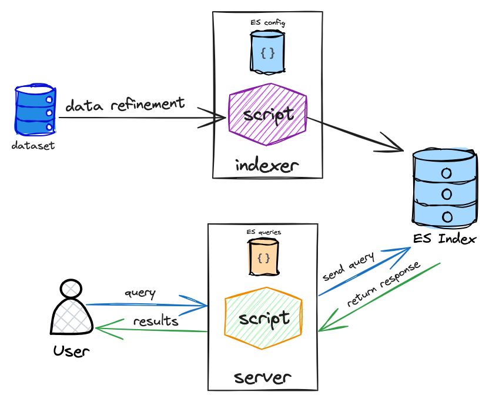

# Elastic_Search_Index

building an index and search engine using elastic search

## Overview

## Avaliable Queries

- fuzzy document search (by content with geo-location & reference date)
- get top most referenced location
- get document distribution over time

## Used Packages

- Spacy (test preprocessing)
- Geopy (for geo location extraction)
- Elasticsearch (building index and querying)
- BeautilfulSoap (extracting text from xml)

### Installation

To start the application you need to have previous pakcages already setup on your device, then do the following:

1. Clone the repository & download dataset.

2. setup elasticsearch and start it.

3. run indexing then start querying.
